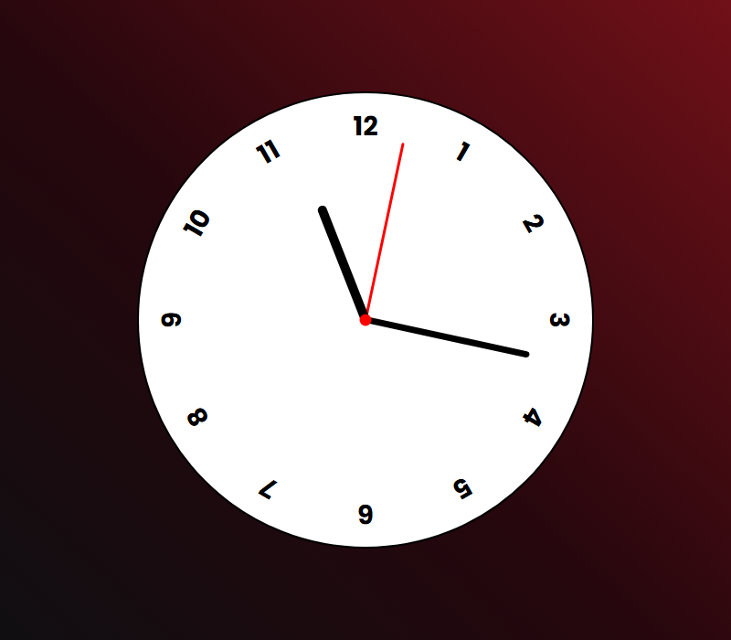

# Old Clock

Relógio analógico funcional, em tempo real, construído apenas com **HTML, CSS e JavaScript puro** — os ponteiros de hora, minuto e segundo se movem de verdade, sincronizados com o horário do sistema.

<div align="center">
  
</div>

## Sobre o projeto

Projeto de estudo focado em duas ideias centrais: **CSS custom properties** (variáveis CSS) controladas via JavaScript, e cálculo de ângulos a partir da hora atual. Cada ponteiro do relógio é rotacionado dinamicamente com base na hora/minuto/segundo atuais, sem nenhuma biblioteca — só `Date()`, `setInterval` e `transform: rotate()`.

## Motivação

Praticar a comunicação entre JavaScript e CSS através de **custom properties** (`--rotation`), em vez de manipular `style.transform` diretamente — uma técnica que mantém a lógica de animação mais organizada e reutilizável. Também foi uma forma de treinar cálculo de proporção/ângulo (transformar segundos, minutos e horas em porcentagem de uma volta de 360°).

## Funcionalidades

- Ponteiros de hora, minuto e segundo em **tempo real**, atualizados a cada segundo
- Cálculo de ângulo em cascata: o ponteiro dos minutos leva em conta os segundos, e o das horas leva em conta os minutos — movimento contínuo, sem "saltos"
- Mostrador numerado (1 a 12) posicionado com rotação em CSS puro
- Visual com gradiente de fundo e tipografia (Google Fonts — Poppins)

## Tecnologias

- **HTML5**
- **CSS3** (custom properties, `transform`, gradientes)
- **JavaScript** (`Date`, `setInterval`, manipulação de estilo via `setProperty`)

## Como rodar localmente

Não tem build nem dependência — é só abrir o `index.html` no navegador, ou servir a pasta com qualquer servidor estático:

```bash
npx serve .
```

---

### Made with ♥ by Erick Dantas | [Contato](https://www.linkedin.com/in/erickkadr/)
